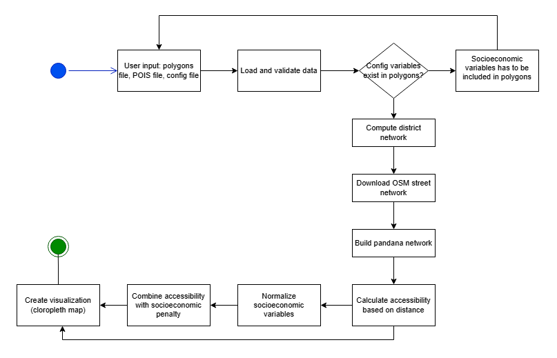
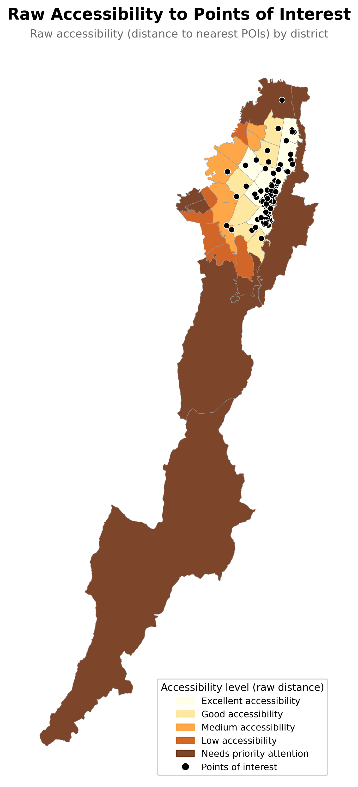
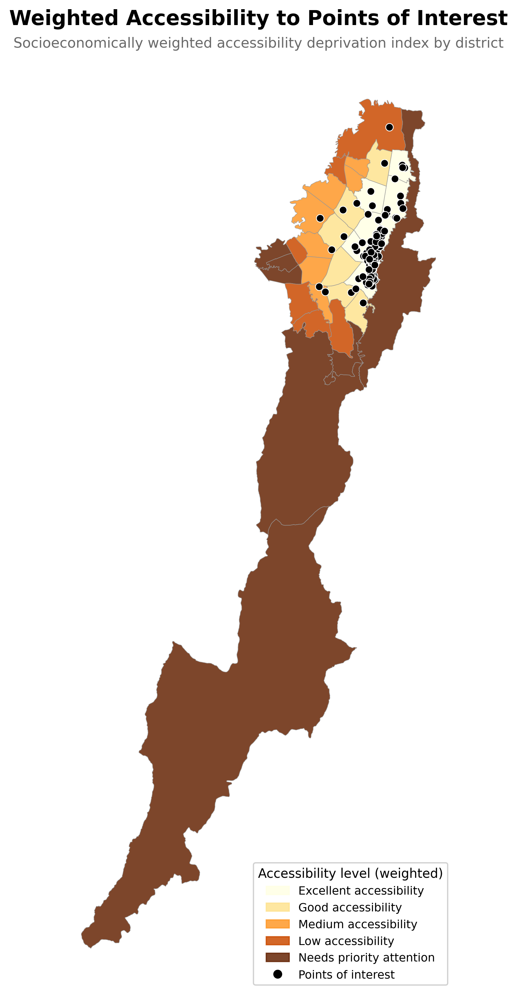

# Accessibility to higher education level

## Overview

### 1. Problem framming

Access to higher education in Bogotá is not spatially equitable. Higher Education Institutions (HEIs) are concentrated in the central and northern areas of the city, resulting in an unequal distribution of educational opportunities across the territory. This spatial inequality is further reinforced by the socioeconomic conditions of the population: Districts with lower income tend to be located further from educational offerings, and subjective factors such as life satisfaction and perception of the neighborhood may compound the difficulty of accessing higher education.

This analysis proposes that physical distance alone is insufficient to measure accessibility. A district may be 2km away from a HEI, but that distance is effectively greater when mediated by low income, dissatisfaction with life, or a weak sense of belonging to the community. The goal is to build a composite accessibility indicator that reflects both the spatial and the human dimensions of this inequality.

### The Inequality Being Assessed

This project examines the unequal spatial distribution of access to higher education across urban territories. Using Bogotá's Urban Planning Units (UPLs) as a case study, it assumes that physical distance to Higher Education Institutions (HEIs) is not the only barrier to access: economic and social factors compound the difficulty, making effective accessibility much harder for vulnerable populations.

### 2. Proposed Solution

This project builds a **composite spatial accessibility index** that combines three dimensions:

1. **Physical proximity**: Network-based distance from each UPL centroid to the nearest Higher Education Institutions
2. **Socioeconomic weighting**: Average household income per UPL, which penalizes accessibility for economically disadvantaged areas
3. **Subjective perception weighting**: Satisfaction with neighborhood and satisfaction with life in general, capturing how people's lived experience of their environment further conditions their ability to access higher education.

The resulting index is mapped across Bogotá's UPLs to reveal which areas face the greatest structural disadvantage in accessing higher education, not only because they are physically distant from HEIs, but because that distance is amplified by economic and subjective factors.

The tool is designed to be reusable: **any city or region with polygon boundaries, points of interest, and socioeconomic variables can run the same analysis**. Income, satisfaction with life, satisfaction with neighborhood, or any other relevant variable can be incorporated as weighting factors to build a composite accessibility indicator tailored to the context.

### 3. How is Justice being assessed?

Justice is assessed from a **distributive** perspective: are educational resources (HEIs) equitably distributed across the territory? And from a **social** perspective: do populations with lower socioeconomic capacity and lower life satisfaction face compounded barriers to accessing higher education?

The composite accessibility indicator built in this analysis allows for identifying which UPLs face the greatest structural disadvantage — not only because they are physically distant from HEIs, but because that distance is amplified by economic and subjective factors.

### 4. Flow diagram




## Why this matters for decision-making

Access to opportunities (universities, hospitals, jobs, parks) is never distributed evenly across a city, and distance alone doesn't tell the whole story: a neighborhood can be geographically close to an institution and still be functionally excluded from it if its residents face poverty, low education, or social vulnerability that compounds the effect of physical distance. This tool makes that combination visible and measurable. By calculating raw network-based accessibility (not straight-line distance, but actual travel distance along real streets) and then weighting it by the socioeconomic conditions a decision-maker chooses to prioritize, it produces a single spatial-justice index that highlights the districts suffering the *double disadvantage* of being both far from key services and socioeconomically vulnerable. Because the analysis works with any polygon boundaries, any set of points of interest, and any user-defined combination of weighted variables, it can support very different real decision, like a city government prioritizing where to build a new school, a university deciding where to open a satellite campus, or a researcher comparing equity outcomes across cities, just new input files.


## Data sources

- Socioeconomic and demographic variables: [Secretaría Distrital de Planeación](https://sdp.gov.co/gestion-estudios-estrategicos/informacion-estadisticas/encuesta-multiproposito)
- Boundaries: [Mapas Bogotá](https://mapas.bogota.gov.co/#)
- Education Institutions: [Ministerio de Educacion Nacional ](https://www.mineducacion.gov.co/portal/)

## Project Structure

```
accessibility-explorer/
├── data/                          # Input data
│   ├── data.geojson               # District polygon boundaries
│   ├──  config.csv                # Configuration file with variables to include and weights
|   └── ies.geojson                # Higher Education Institutions points
├── src/
│   └── swm/
│       ├── accessibility.py       # Raw accessibility computation
│       ├── io.py                  # Data loading and validation
│       ├── main.py                # Entry point
│       ├── network.py             # Street network download and build
│       ├── pois.py                # POI registration
│       ├── accessibility.py       # Raw accessibility computation
│       ├── socioeconomic.py       # Socioeconomic computation
│       └── viz.py                 # Visualization
├── pyproject.toml                 # Dependencies and project config
├── README.md                      
└── LICENSE
```

## Data loading and preprocessing

### 0. Raw data

The source CSV files were obtained from the Encuesta Multipropósito, conducted jointly by DANE (Departamento Administrativo Nacional de Estadística) and the Secretaría Distrital de Planeación of Bogotá D.C. The survey is published as a large Excel workbook containing a wide range of socioeconomic and demographic variables at the UPL (Unidad de Planeamiento Local) level. From this workbook, a selection of variables considered relevant for an accessibility to education analysis were identified and exported individually as CSV files, each prefixed with em to indicate their origin from the Encuesta Multipropósito.

### 1. Loading CSV Files

All CSV files are loaded dynamically from a local folder and each of them is read into a dataframe.

**Example:** `em_ingreso_por_hogar.csv` → dataframe stored as `dfs["ingreso_por_hogar"]`

---

### 2. Merging into the `upl` Dataframe

A selection of columns from each source dataframe is merged into the main `upl` geodataframe using `CODIGO_UPL` as the join key (left join). Initially, several columns have been added even if now are not used (available to do future analysis)

When multiple dataframes share a column name (e.g., `PROMEDIO`), columns are automatically renamed to `{df_name}_{column_name}` in lowercase to avoid conflicts.

#### Resulting Column Names

| Source Dataframe                    | Original Column    | Renamed To                                        |
|-------------------------------------|--------------------|---------------------------------------------------|
| `ingreso_por_hogar`                    |`PROMEDIO`       | `ingreso_por_hogar_promedio` |                
|`satisfaccion_con_barrio_comunidad` | `PROMEDIO`|`satisfaccion_con_barrio_comunidad_promedio`|
|`satisfaccion_con_la_vida` | `PROMEDIO`|`satisfaccion_con_la_vida_promedio`|

---
### 3. Join Strategy

- **Type:** Left join — all rows from `upl` are preserved.
- **Key:** `CODIGO_UPL` — present in all source dataframes, not duplicated in the output.
- **Result:** A single enriched `upl` dataframe with one row per UPL unit and all relevant indicators as columns.

##### Notes

- All merged column names are lowercased to ensure consistency.
- All source files included a `codigo_upl` column to be mergeable.


### 4. Result

<table>
<tr>
<td></td>
<td></td>
</tr>
<tr>
<td align="center"><em>Raw accessibility</em></td>
<td align="center"><em>Weighted accessibility</em></td>
</tr>
</table>

---

### 5. Conclusion

The Bogotá analysis reveals a clear pattern of spatial inequality: peripheral districts, particularly in the south and southwest of the city, face both the longest distances to higher education institutions and the most disadvantaged socioeconomic conditions; this is a combination that pushes them further down in the weighted index than raw distance alone would suggest. Central and northern districts, where most universities are concentrated, consistently show better accessibility. This confirms that unequal access to higher education in Bogotá isn't just a matter of physical distance, it's compounded by the socioeconomic conditions of the people living farthest away, making these districts the clearest priority for interventions aimed at improving both educational supply and social conditions.

## Licencia
This project is under [MIT](./LICENCE.md).


